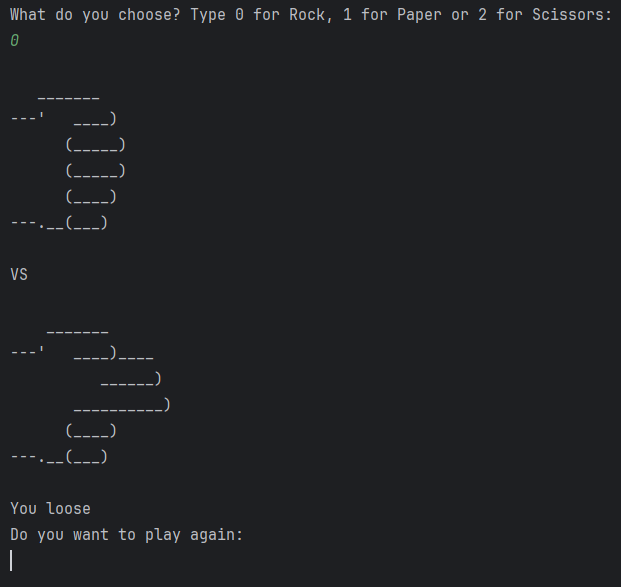

# 🪨 Rock Paper Scissors Game

A beginner-friendly command-line Python project that allows users to play the classic Rock-Paper-Scissors game against the computer.

## 🎮 How It Works
- The user selects 0 (Rock), 1 (Paper), or 2 (Scissors).
- The computer randomly selects one of the three.
- The winner is determined based on standard game rules.
- The game loops until the user chooses to stop.

## 🧰 Tech & Concepts Used
- Python
- `input()` for user interaction
- `random.randint()` for computer choice
- Conditional logic (`if-elif-else`)
- Lists and loops

## 📌 Key Features
- ASCII Art display for each hand
- Input validation for user choices
- Play again feature using a while loop

## 📷 Screenshot


## 🚀 Run the Game
```bash
python rock_paper_scissors.py
